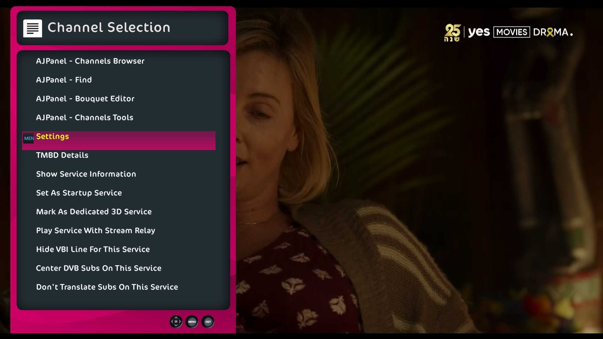
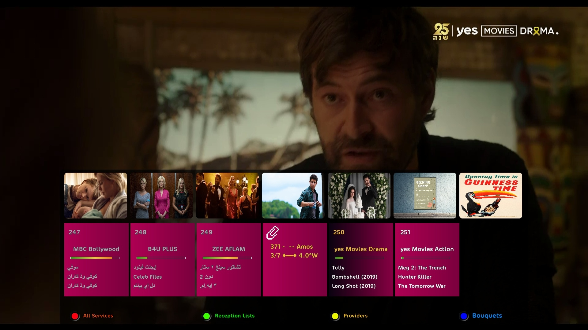
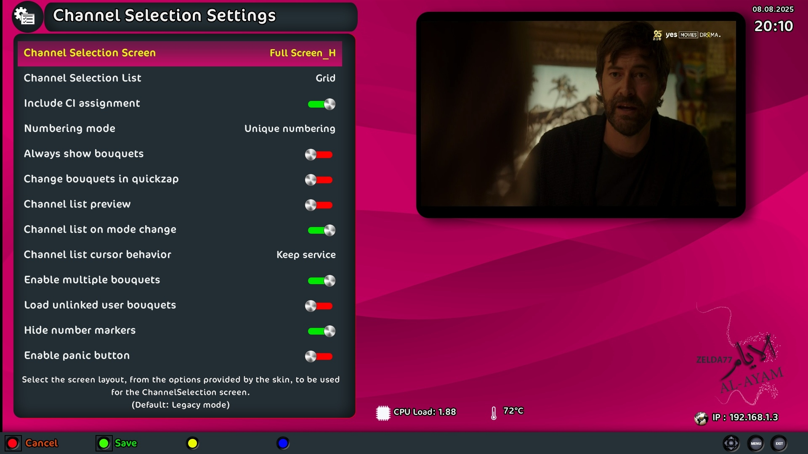
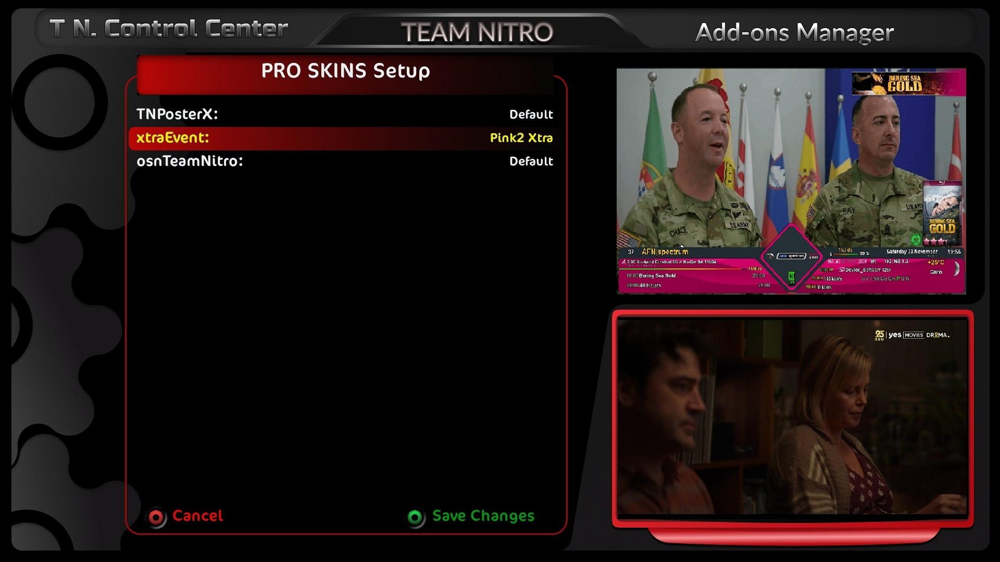
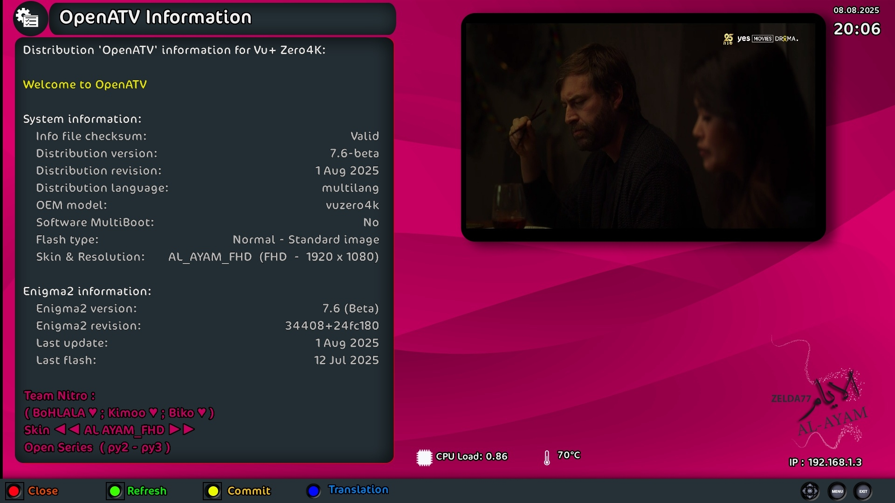

# enigma2-plugin-skins-al-ayam-fhd

❀❀ **AL_AYAM_FHD Skin** ✿ by Nitro Team ❀❀

The Nitro Team proudly presents the new **AL_AYAM_FHD** skin.  
Originally designed by **zelda77** in 2022, the main covers were shared with us, but the project was shelved for a while due to life’s demands.  
Thanks to **@bo-hlala** and **Kaleem (Kimoo1987)**, the interfaces have now been redesigned and enhanced — blending the original style with fresh new looks for the release you see today.

---

## Available Colors

The skin comes in three primary color themes:
- **Pink**
- **Brown**
- **Green**

Additionally, the **Pink** theme includes alternative screens to suit different tastes.

---

## Features

- ✔ Compatible with all open-source Python 2 and Python 3 Enigma2 images.  
- ✔ Fully supports the latest **OpenATV** and **Egami** releases, including the updated channel list display.  
- ✔ Switch between skins and interfaces via the **Nitro Team Control Center**.  
- ✔ Displays **CAID** and **Active CAID** for channels — useful when a channel has multiple CAIDs but only one is active.  
- ✔ Vertical menu designs (instead of horizontal).  
- ✔ New Time-Shift and Translation plugin screens.  
- ✔ Analog signal strength and quality indicators on both Info Bar and Second Info Bar.  
- ✔ Completely redesigned **Full Channel Selection Grid**.  
- ✔ Integrated script to fetch poster and backdrop images for Sky channels, displayed in the main menu background — can be updated manually or automatically via cron. *(Thanks to developer KiddaC for this addition.)*  
- ✔ Redesigned Info Bar with channel beacons on right, center, and left.  
- ✔ Extra-event-based skins available directly in the plugin and via component **X**.

---

## Screenshots








---

## Credits

♡♡ Heartfelt thanks and appreciation to my dear brothers for their continuous support and partnership in the Nitro Team. ♡♡

---

## Installation

1. Upload the `.ipk` package to your receiver (e.g. to `/tmp`).
2. Install via Telnet/SSH or DCC:
   ```bash
   opkg install --force-overwrite /tmp/enigma2-plugin-skins-al-ayam-fhd.ipk
